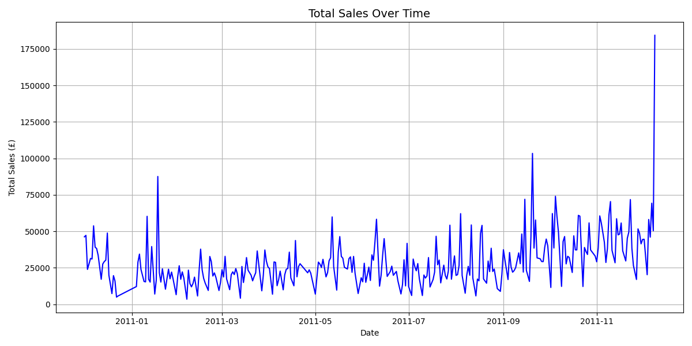
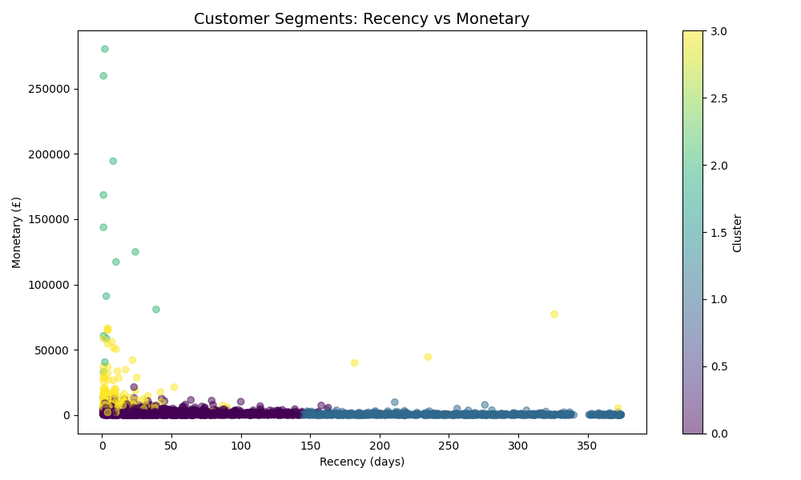
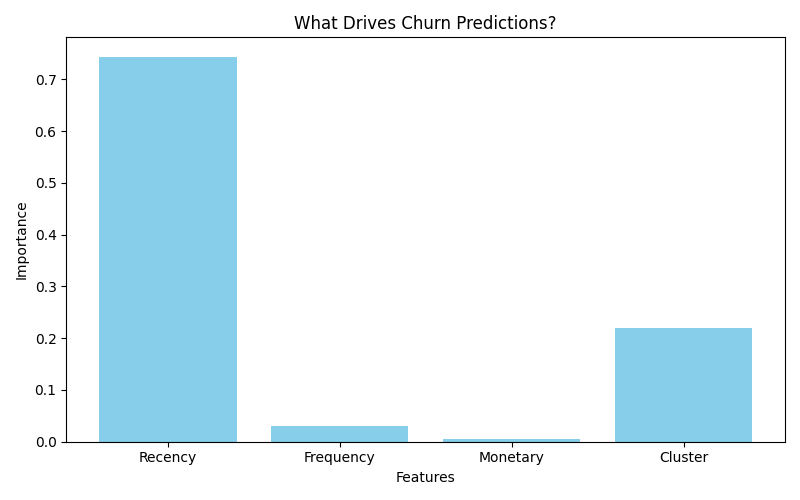

# Ecommerce-Customer-Analytics
Digging into an online retail dataset to figure out customer habits who’s staying, who’s leaving, and what to do about it. It’s got the whole deal cleaning, plotting, clustering, and predicting all stuff. I’m proud to show off.
# overview
**Tools**: Python (Pandas, Numpy, Scikit-learn), Plotting (Matplotlib, SEABORN), Jupyter Notebooks, Git to keep it tracked 
**Goals**: Customer segmentation, chrun prediction, and actionable business insights.

## How to Run
1. Grab this repo: `git clone https://github.com/Sairam0503/Ecommerce-Customer-Analytics`
2. Install stuff: `pip install -r requirements.txt`
3. Get the dataset from [UCI](https://archive.ics.uci.edu/ml/datasets/Online+Retail) and put it in `data/`.
4. Open the notebooks in Jupyter and run them.

## Some Pics
- Sales trend: 
   *Shows sales spiking late 2011—holiday rush, maybe?*
- Clusters: 
   *Groups customers by Recency and spend—VIPs vs. drop-offs!*
- What matters: 
   *Recency rules churn—biggest clue someone’s leaving

### What We Got Done
I took a raw e-commerce dataset and made it tell a story—cleaned it up, found sales spikes and big markets, grouped customers into 4 types, predicted who’s leaving (about 20%), and figured Recency’s key. Ended up with solid tips like loyalty perks and re-engagement emails. Pretty neat payoff!